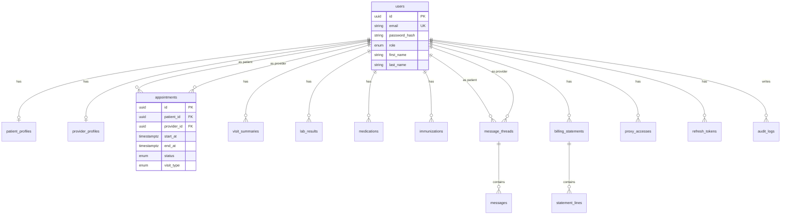

# Meridian Health API

Express.js + Sequelize + PostgreSQL backend for the Meridian Health multi-role healthcare platform (patients, providers, admins).

> This folder is named `backend/` (not `server/`) to match the existing project layout. Behavior and structure match the required API design.

## Stack

- Node.js (CommonJS, plain JavaScript — no TypeScript)
- Express 5
- Sequelize ORM + PostgreSQL (`pg`)
- Zod validation, JWT access tokens + httpOnly refresh cookies, bcrypt (≥12 rounds)
- Helmet, CORS, morgan, express-rate-limit

## Local setup

### 1. PostgreSQL

Install PostgreSQL locally (no Docker). Create a role/database or use defaults from `.env.example`.

```bash
# Example with psql
sudo -u postgres createuser -s postgres   # if needed
sudo -u postgres createdb meridian_health
```

### 2. Environment

```bash
cd backend
cp .env.example .env
# Edit DB_* / JWT_* secrets
npm install
```

### 3. Migrate & seed

```bash
npm run db:create      # creates DB from config (if missing)
npm run db:migrate
npm run db:seed
npm run dev            # http://localhost:5000
```

Reset (undo all → migrate → seed):

```bash
npm run db:reset
```

### Frontend (Vite proxy)

From `frontend/`:

```bash
npm install
npm run dev            # http://localhost:5173 — proxies /api → :5000
```

## Demo credentials (seed data only)

| Role     | Email                     | Password     | MFA code |
|----------|---------------------------|--------------|----------|
| Patient  | patient@meridian.health   | password123  | 123456   |
| Provider | provider@meridian.health  | password123  | 123456   |
| Admin    | admin@meridian.health     | password123  | 123456   |

In non-production, any 6-digit code is also accepted.

## Auth flow

1. `POST /api/v1/auth/login` or `/register` → `{ requiresMfa, pendingToken, maskedPhone, pendingUser }`
2. `POST /api/v1/auth/verify-mfa` with `{ pendingToken, code }` → `{ token, user }` + `refreshToken` httpOnly cookie
3. Send `Authorization: Bearer <accessToken>` on API calls
4. `POST /api/v1/auth/refresh` (cookie) rotates refresh + returns new access token
5. `GET /api/v1/auth/me` returns the current user

## Role / permission matrix

| Capability | Patient | Provider | Admin |
|------------|---------|----------|-------|
| Own appointments CRUD | ✓ | view/update own schedule | ✓ |
| Book appointment | ✓ | — | ✓ (on behalf) |
| Own medical records | ✓ | scoped via patientId | ✓ |
| Messaging | ✓ | ✓ (own threads) | — |
| Billing | ✓ own | — | — |
| Profile / proxies | ✓ | — | — |
| Provider directory | public (active) | — | full + approve/reject |
| Patient list | — | ✓ | ✓ |
| Admin dashboard KPIs | — | — | ✓ |
| Audit logs written | on PHI access | on PHI access | on PHI access |

Ownership: patients only see their own records; providers only their patients/appointments; admins have platform oversight.

## API surface (`/api/v1`)

| Method | Path | Notes |
|--------|------|-------|
| GET | `/health` | Liveness |
| POST | `/auth/register` | Patient signup |
| POST | `/auth/login` | Step 1 |
| POST | `/auth/verify-mfa` | Step 2 |
| POST | `/auth/refresh` | Cookie refresh |
| POST | `/auth/logout` | Revoke refresh |
| GET | `/auth/me` | Current user |
| GET/POST/PATCH/DELETE | `/appointments` | + `/slots` |
| GET/PATCH | `/providers` | Public list; admin patch |
| GET | `/patients` | Admin/provider |
| GET | `/records/visits\|labs\|medications\|immunizations` | |
| POST | `/records/medications/:id/refill` | |
| GET/POST | `/messages` | Threads + send |
| GET/POST | `/billing` | Overview + pay |
| GET/PATCH | `/profile` | Personal, insurance, notifications, proxies |
| GET | `/dashboard/patient\|admin` | Summary cards |

Success: `{ data, meta? }` · Error: `{ error: { code, message, details? } }`

## ERD (Mermaid)



Double-booking prevention: GiST exclusion constraint `appointments_no_provider_overlap` on scheduled appointments (migration uses raw SQL because Sequelize cannot express exclusion constraints).

## Tests

```bash
# Ensure meridian_health_test exists and is migrated
NODE_ENV=test npx sequelize-cli db:create
NODE_ENV=test npm run db:migrate
npm test
```

Covers auth/MFA, role authorization, appointment booking, and scheduling conflicts.

## PHI / HIPAA-oriented notes

This API implements practical safeguards (least-privilege RBAC, audit logs, helmet, CORS, rate limits, password hashing, no password hashes in responses, redacted logging, generic auth errors). **It is not HIPAA-compliant as shipped.**

Still required for a compliance program: encryption at rest, TLS everywhere, BAAs with vendors, formal access reviews, backup/retention policies, breach procedures, workforce training, unique user attribution beyond demo MFA, and a security risk analysis.

## Project layout

```
backend/
  .sequelizerc
  config/           # env + sequelize-cli environments
  models/           # Sequelize models + associations
  migrations/
  seeders/
  src/
    app.js          # Express middleware + route mount
    server.js       # Bootstrap + graceful shutdown
    controllers/
    routes/
    middleware/
    validators/
    utils/
  tests/
```

Schema is managed **only** through migrations — never `sequelize.sync({ force/alter })`.
